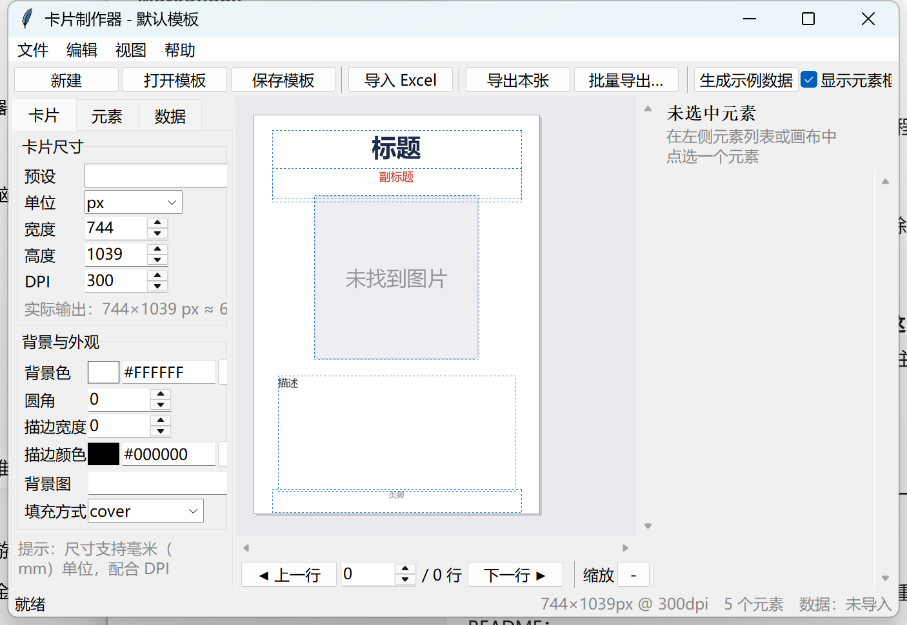

# 卡片制作器（Card Maker）
# By 卡片
一个用 Python 写的**可视化卡片制作工具**：框定卡片尺寸 → 摆放文本 / 图片元素 → 导入 Excel 表格 → 每行一张卡片批量导出 PNG / JPG / PDF。支持打包成免安装的 Windows exe。



## 功能

- **卡片尺寸任意框定**：像素（px）、毫米（mm）、厘米（cm）、英寸（in）均可，内置扑克牌 / 塔罗牌 / 名片等预设，配合 DPI 直接对应印刷尺寸
- **可视化编辑**：画布上直接拖拽移动元素、拖右下角改尺寸、方向键微调；右侧属性面板精确编辑坐标、字号、粗体、斜体、颜色、对齐、行距、字距、描边、投影、圆角等
- **Excel 批量生成**：一个 sheet 的每一行就是一张卡片，逐行预览、逐行导出
- **逐行属性覆盖**：同一列不同行可以有不同字号 / 颜色 / 坐标 / 图片
- **批量导出**：PNG / JPG / WEBP / BMP / 多页 PDF，文件名可用任意列组合
- **模板保存**：`.cardjson` 模板文件可复用、可分享

## 快速开始

```bash
# 1. 安装依赖（建议 Python 3.10+）
pip install pillow openpyxl pyinstaller

# 2. 生成示例数据（samples/示例卡片.xlsx + 示例配图）
python make_sample.py

# 3. 启动界面
python main.py
```

启动后：菜单「帮助 → 生成示例数据」会自动生成并导入一套示例，点「批量导出」即可体验完整流程。

## Excel 列名约定（核心）

设某个元素的名字叫 **标题**（元素名 = 绑定的列名，双击元素列表可改名）：

| 列名 | 作用 |
|---|---|
| `标题` | 元素内容（图片元素则是本地文件路径） |
| `标题.x` `标题.y` | 逐行覆盖坐标（下划线写法 `标题_x` 同样有效） |
| `标题.size` | 覆盖字号 |
| `标题.bold` / `标题.italic` | 覆盖加粗 / 斜体（`1` / `true` / `是` 均可） |
| `标题.color` | 覆盖颜色（`#FF0000`、`红色`、`255,0,0` 均可） |
| `标题.font` | 覆盖字体（字体名如 `黑体`，或字体文件路径） |
| `标题.w` / `标题.h` | 覆盖文本框宽高 |
| `标题.align` / `标题.valign` | 水平 / 垂直对齐（left/center/right、top/middle/bottom） |
| `标题.spacing` | 行距倍数 |
| `标题.rotate` | 旋转角度（度） |
| `标题.opacity` | 不透明度 0~1 |
| `标题.fit` / `标题.radius` | 图片填充方式（cover/contain/stretch/original）/ 圆角 |

- 没有后缀的列就是**内容列**；带后缀的列是**属性覆盖列**，每行可以不同。
- 文本内容支持 `{{列名}}` 占位符，例如 `{{姓名}} 的攻击力 {{攻击力}}`。
- 图片列填**本地文件路径**（绝对路径，或相对 Excel 文件的路径）。

### 示例表格

| 标题 | 副标题 | 描述 | 图片 | 标题.color | 描述.size |
|---|---|---|---|---|---|
| 炎龙战士 | FIRE DRAGON | …… | D:\图\龙.png | #B22222 | 26 |
| 深海使者 | DEEP SEA | …… | D:\图\海.png | #1B5E8C | 24 |

## 打包成 exe

```bash
python build.py              # 目录版（推荐，启动快）
python build.py --onefile    # 单文件版
python build.py --console    # 带控制台，便于排查问题
```

产物在 `dist/` 目录：`dist/卡片制作器/卡片制作器.exe`（目录版整个文件夹都可拷贝到其他 Windows 电脑使用）。

## 快捷键

| 按键 | 功能 |
|---|---|
| Ctrl+N / O / S | 新建 / 打开 / 保存模板 |
| Ctrl+I | 导入 Excel |
| 方向键 | 微调选中元素 1px（Shift + 方向键 = 10px） |
| Ctrl+D / Delete | 复制 / 删除选中元素 |
| PageUp / PageDown | 上一行 / 下一行 |
| Ctrl + 滚轮 | 画布缩放 |

## 项目结构

```
card_maker/
├── main.py              入口
├── build.py             打包脚本
├── make_sample.py       生成示例数据
├── selftest.py          无界面自检
├── cardmaker/
│   ├── model.py         卡片模板与元素数据模型
│   ├── renderer.py      Pillow 渲染引擎（排版/换行/竖排/斜体合成）
│   ├── fonts.py         字体解析与粗斜体变体
│   ├── data_source.py   Excel/CSV 读取与列绑定
│   ├── exporter.py      批量导出
│   ├── samples.py       示例数据生成
│   └── ui/              Tkinter 界面（主窗口 / 画布 / 属性面板 / 组件）
└── samples/             示例表格与配图
```
